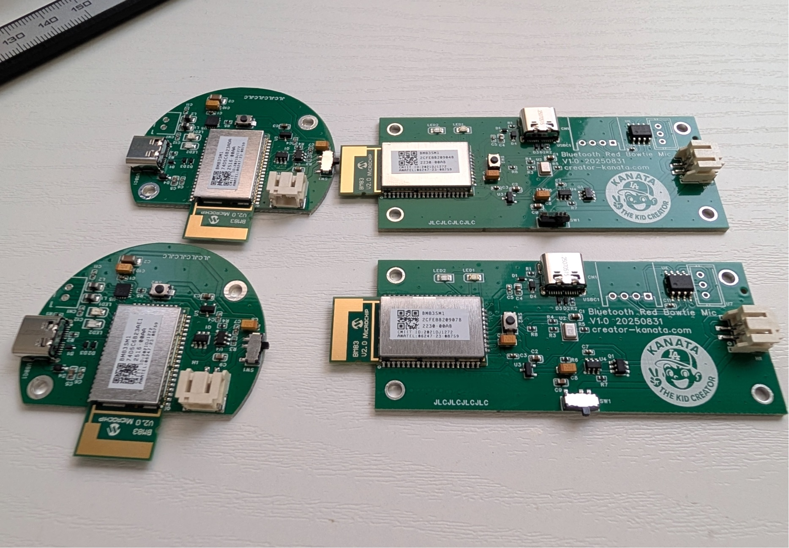

# Conan-Style Voice Changer: Bowtie Mic & Button Speaker

A real-world implementation of the iconic voice changer bowtie from Detective Conan anime.


<a href="https://github.com/CreatorKanata/conan-style-voice-changer-mic-speaker/blob/main/images/thumbnail-jlcpcb.jpg?raw=true"></a>

### Demo Video

<a href="https://www.youtube.com/shorts/dokzC9MDHtE"></a>

https://www.youtube.com/shorts/dokzC9MDHtE

### PCB Design on OSHWLab

<a href="https://oshwlab.com/takehide22/conan-style-mic-speaker"></a>

https://oshwlab.com/creator-kanata/conan-style-mic-speaker

## Overview

This project brings the fictional "voice changer bowtie" from Detective Conan to life. It consists of:

- **Bowtie Microphone**: A wearable microphone in the classic bowtie shape
- **Button Speaker**: A discreet speaker that can be placed anywhere
- **Raspberry Pi 5**: The processing unit that handles voice changing and translation

## Features

- **Real-time Voice Changing** using voice-changer (Beatrice)
- **Japanese to English Translation** using Gemini Live API *(planned)*
- **Wireless Operation** via Bluetooth (HFP for mic, A2DP for speaker)
- **Portable Design** with battery-powered peripherals

## Hardware

### Bowtie Microphone

<a href="https://github.com/CreatorKanata/conan-style-voice-changer-mic-speaker/blob/main/images/bowtie-mic-pcb-case.jpg?raw=true"></a>

| Component | Description |
|-----------|-------------|
| BM83 | Bluetooth audio module (HFP profile) |
| MEMS Mic | High-quality voice capture |
| Battery | Rechargeable LiPo |
| Case | 3D printed bowtie shape |

### Button Speaker

<a href="https://github.com/CreatorKanata/conan-style-voice-changer-mic-speaker/blob/main/images/button-speaker-pcb-case.jpg?raw=true"></a>

| Component | Description |
|-----------|-------------|
| BM83 | Bluetooth audio module (A2DP profile) |
| Speaker | Thin form factor speaker |
| Battery | Rechargeable LiPo |
| Case | 3D printed button shape |

## Project Structure

```
├── 3d-models/              # 3D printable case designs (STEP)
│   ├── bowtie-mic/         # Bowtie microphone case
│   │   ├── red-bowtie-mic.step
│   │   └── red-bowtie-mic-bottom.step
│   └── button-speaker/     # Button speaker case
│       ├── button-speaker-top.step
│       └── button-speaker-bottom.step
├── pcb/
│   ├── bowtie-mic/         # Microphone PCB (EasyEDA Pro)
│   └── button-speaker/     # Speaker PCB (EasyEDA Pro)
├── raspi5/                 # Raspberry Pi 5 configuration and scripts
└── docs/                   # Documentation
```

## Getting Started

### Hardware Manufacturing

1. **PCB Fabrication**: Upload Gerber files from `pcb/` to [JLCPCB](https://jlcpcb.com)
2. **3D Printing**: Print cases from `3d-models/` (STEP format)
3. **Assembly**: Solder components as per BOM files

### Software Setup (Planned)

See [docs/PLAN.md](docs/PLAN.md) for the detailed implementation plan.

## Documentation

- [Concept](docs/concept.md) - Project vision and architecture
- [Implementation Plan](docs/PLAN.md) - Detailed development roadmap

## Tools Used

| Purpose | Tool |
|---------|------|
| PCB Design | EasyEDA Pro |
| 3D Modeling | Autodesk Fusion |
| Voice Processing | Raspberry Pi 5 |
| Voice Changer | [voice-changer (Beatrice)](https://github.com/w-okada/voice-changer) |
| Translation | Gemini Live API |

## Sponsor

3D printing for this project is proudly sponsored by **[JLCPCB](https://jlcpcb.com)**. Thank you for the support!

## License

This project is open source. See LICENSE file for details.

## Acknowledgments

- Inspired by Detective Conan (Case Closed) by Gosho Aoyama
- Built with love for the anime community
